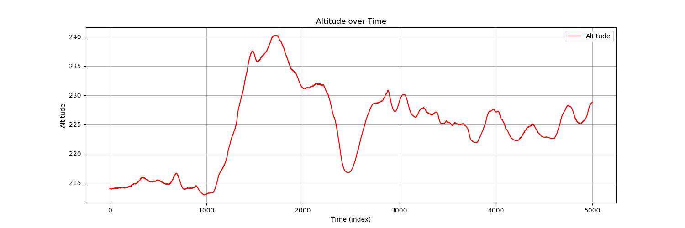

# ManeuverDetection
This repository hosts implementations for detecting driving maneuvers using rule-based and machine learning approaches. It aims to enhance vehicle safety and intelligence by accurately identifying driving behaviors, combining traditional and modern techniques for comprehensive analysis.

