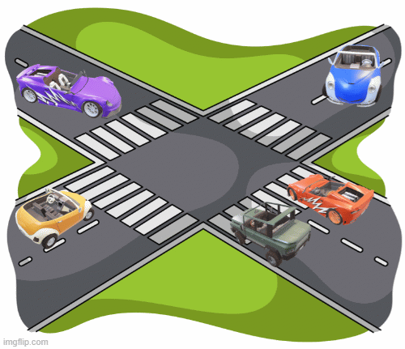

# Driving Maneuver Detection

This repository hosts implementations for the "From Wheels to AI: Advanced Driving Maneuver Detection Through Active Learning Employing Vehicle Dynamics" paper, detecting driving maneuvers using rule-based and machine-learning approaches. It aims to enhance vehicle safety and intelligence by accurately identifying driving behaviors, combining traditional and modern techniques for comprehensive analysis.

# Abstract

Detecting driving maneuvers from vehicle dynamics and other driver-specific data can improve the safety margins of Advanced Driver Assistance Systems (ADAS) by enabling early detection of dangerous driving events. Building these predictive models requires large annotated datasets that are labor-intensive to construct using manual labeling. To overcome this challenge, this paper introduces a novel and effective approach for maneuver detection by harnessing vehicle dynamic signals through Active Learning. By engineering informative dynamic signals as features and employing an Active Learning strategy, maneuver types can be accurately identified. Utilizing XGBoost as its core, our approach achieved a Macro accuracy of 91.40\%—a critical metric for assessing performance in imbalanced datasets— across more than 44,200 test samples from a total of 58,936.

# Dynamic Signals

We proposed to use some informative dynamic signals to detect the maneuver. 
The dataset used in this project can be found in the `Src/Feature_Vector_initial.csv` file.

# Rule-based Maneuver Detection

In this approach, we explore various vehicle signals alongside the steering wheel's position, which is derived from images of the steering wheel. Our investigation identifies the "Angular Velocity Z component" as the most informative feature. `Src/UtsoThresholding.py` shows how to apply Utso's thresholding on the angular velocity Z component to segment the maneuvers.  

# Active Learning-based Maneuver Detection

In the second approach, due to the limitations of the rule-based method in handling five maneuvers while focusing on only one feature, which is insufficient for lane-changing maneuvers, we propose a novel approach based on "Active Learning" that leverages ML as its core building block.  Here we proposed a methodology that can handle a huge number of samples by keeping the human in the loop as the oracle while the majority of samples are labeled by the Machine learning model iteratively. 

# Steering Wheel Angle Detection

The `Src/Steerinwhellangledetection.csv` file shows how to detect the relative Steering Wheel angle using decoding the ArUco marker stuck on the steering wheel.

# Usage

- [ ] Find `Feature_initial.csv` file that includes 16 features of 58,936 samples (three drivers). 
- [ ] Apply `` for 

